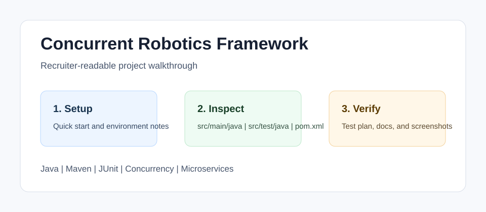

<!-- bettergithub:generated-readme -->
# Concurrent Robotics Framework

Concurrent Robotics Framework is a Java microservice simulation for robotic perception, sensor events, and map fusion. It helps reviewers inspect thread coordination, callbacks, a message bus, camera and LiDAR services, GPS/IMU pose handling, and a Maven test suite around the core concurrency and SLAM-inspired domain logic.

## Tech Stack

- Java
- Maven
- JUnit
- Concurrency
- Microservices
- GitHub Actions

## Quick Start

```bash
mvn test
mvn package
Run the application entry point with a local JSON input file.
```

## Usage

- Review the message bus and service classes first.
- Inspect tests under src/test/java.
- Use the docs to understand sensor and fusion responsibilities.

## Environment Variables

No .env file or API key is required. Java and Maven are the expected local configuration.

## Demo and Screenshots



The diagram above is a lightweight walkthrough image for GitHub reviewers. It shows the reviewer path, the implementation areas to inspect, and the evidence this repository provides. For non-web course projects, this replaces a live demo with reproducible local setup and manual verification notes.

## Testing and Quality

Testing is documented even when the original assignment uses manual verification instead of a full automated suite.

```bash
mvn test
```

See [docs/test-plan.md](docs/test-plan.md) for the manual or automated checks that should be used before presenting this repository.

## Repository Structure

- `src/main/java`
- `src/test/java`
- `pom.xml`
- `docs`

## Architecture Notes

The framework separates message types, services, application objects, and tests. The docs describe how concurrency flow and sensor data fusion are intended to be reviewed.

See [docs/architecture.md](docs/architecture.md) for a more detailed reviewer map.

## Recruiter Notes

- The README opens with the project purpose, audience, and result so the repository is scannable.
- Setup, environment, usage, testing, and architecture notes are collected in predictable sections.
- Existing source code was not changed by the documentation polish pass.

## Roadmap

- Add a short result screenshot or terminal capture after the project is rerun locally.
- Add one small automated smoke test if the course/tooling environment makes it practical.
- Keep the README aligned with the latest verified run command.

## Existing Project Notes

📍 Concurrent Robotics Framework — Java (Microservices + Sensors + SLAM)

This project implements a concurrent Java-based microservice framework that simulates the perception and mapping pipeline of an autonomous vacuum-mop robot. Multiple sensor services—Camera, LiDAR, GPS, and IMU—run in parallel and synchronize using threads, locks, callbacks, and Java 8 concurrency utilities. The system fuses sensor outputs to produce a simplified SLAM-like mapping process.

🛠 Core Features

Multithreaded sensor simulation

Camera: object detection (no coordinates)

LiDAR: 3D point cloud processing via multiple worker threads

IMU + GPS: pose tracking in a global reference frame

Data fusion pipeline

Combines outputs from all sensors

Maps landmarks into shared coordinate system

Updates recurring detections via weighted averaging

Custom microservice architecture

Node-based sensor system similar to ROS

Messaging + callbacks for inter-thread communication

Synchronized shared data structures

Concurrency principles

Thread pools / workers

Java concurrent collections

Minimal locking + performance focus

No unsupported exceptions or signature changes (strict spec compliance)

📚 Concepts & Technologies
Topic	Used
Java Threads	✔
Synchronization (synchronized, locks)	✔
Lambdas & Functional Interfaces	✔
Callbacks + Event-driven messaging	✔
Concurrent data structures	✔
Parallel workload simulation	✔
Sensor fusion & mapping logic	✔
📂 Project Structure (Expected)
src/
  ├── camera/
  ├── lidar/
  ├── imu/
  ├── gps/
  ├── fusion/
  └── framework/   # microservice + messaging logic

🚀 Running
javac -cp src -d bin $(find src -name "*.java")
java -cp bin Main


(Adjust based on your actual file layout)

🔍 Example Workflow

Start system clock + services

Each sensor publishes readings each tick

LiDAR processes data using multiple worker threads

Fusion module merges object IDs into global map

Re-detections update landmark estimates

📌 Key Rules From The Assignment

You must not change method signatures or add new exceptions.

Only add data members where allowed by documentation.

Synchronize only when necessary—performance matters.

Must run and compile on CS Lab UNIX machines.

🧪 Goals of This Project

Practice high-performance concurrency in Java

Coordinate independent services with shared state

Prototype robotics processing pipelines without ROS

Gain hands-on experience with SLAM-style data fusion

